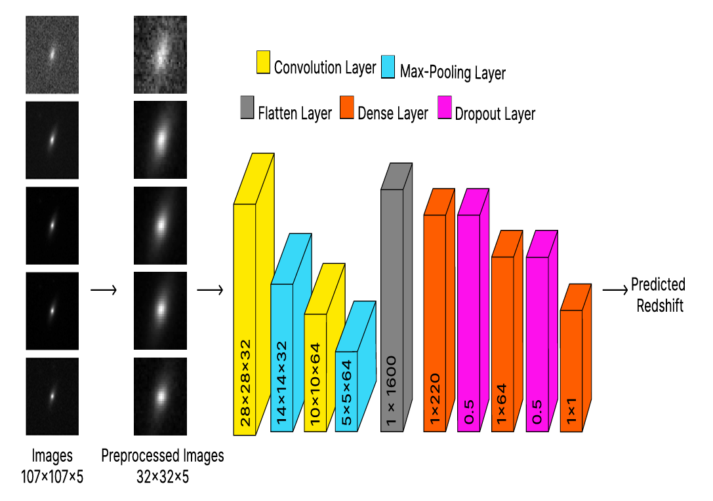

# AstroSpect: Predicting Redshift of Celestial Objects from Multi-Band Galaxy Images

A lightweight Convolutional Neural Network (CNN) that estimates **photometric redshift** (photo-z) directly from raw, multi-band galaxy images, trained on data from the **Sloan Digital Sky Survey (SDSS DR12)**. This approach offers a fast, scalable alternative to traditional spectroscopic redshift estimation.

---

## Overview

Understanding galaxy redshift is crucial in cosmology — it tells us how far away and how old a galaxy is. But measuring redshift using spectroscopy requires expensive equipment and takes a lot of time.

This project presents a faster, image-based alternative using deep learning. We built a CNN that takes **32x32x5 galaxy image cubes** — basically, small images of galaxies captured in 5 different color filters: **u, g, r, i, z** — and learns to predict how redshifted (i.e., distant) the galaxy is.

---

## Model Architecture

We designed a CNN (Convolutional Neural Network) that works like a smart pattern detector. It looks at the galaxy images and learns to estimate the redshift without needing any manual calculations or domain-specific formulas.

### Architecture Breakdown

Here’s what happens step-by-step:

1. **Input Layer:** A 32x32 image with 5 channels (one for each photometric band).
2. **Conv2D Layer 1:** Learns 32 patterns using 5x5 filters, followed by ReLU activation.
3. **MaxPooling2D:** Shrinks image size to retain only important info (2x2 pooling).
4. **Conv2D Layer 2:** Learns 64 more complex patterns, again with 5x5 filters + ReLU.
5. **MaxPooling2D:** Again reduces size to focus on most meaningful parts.
6. **Flatten:** Converts the data into a 1D array for the next layers.
7. **Dense Layer 1:** Fully connected layer with 220 neurons + ReLU.
8. **Dropout:** Randomly drops 50% of the connections to prevent overfitting.
9. **Dense Layer 2:** Another fully connected layer with 64 neurons + ReLU.
10. **Dropout:** Another dropout layer to regularize.
11. **Output Layer:** Single neuron with **Sigmoid** activation to predict a value between 0 and 1 (normalized redshift).

---

## Data Pipeline (Simple Explanation)

To predict how far away a galaxy is (its redshift), we first prepare the data so our neural network model can understand it.

### Input Images

- Each galaxy is converted into a small image of size `32x32 pixels`.
- Instead of a regular color image (Red, Green, Blue), we use **five filters**:
  - **u (ultraviolet)**
  - **g (green)**
  - **r (red)**
  - **i (infrared)**
  - **z (deep infrared)**
- This gives us a **5-channel image** or tensor: `32x32x5`.

#### Sample Input Image Cube

Below is an example of a galaxy shown in the five SDSS photometric bands:

### Preprocessing

- All image values are scaled (normalized) between 0 and 1.
- Redshift values are also normalized so the model can learn efficiently.

### What the CNN Does

1. It takes the 5-band galaxy image as input.
2. Learns patterns related to shape, brightness, and band combinations.
3. Outputs a redshift prediction (a number between 0 and 1).
4. Later, this is scaled back to get the real redshift.

This whole process removes the need for hand-crafted features or traditional redshift fitting.

---

## Redshift Prediction Results

We tested our model on two versions of the dataset:

1. **Full Dataset:** Includes all galaxies, even those with extreme redshift values.
2. **Clipped Dataset:** Removes galaxies with very high redshift (e.g., z > 0.4) to reduce outliers.

### Key Findings

| Metric                          | Full Dataset | Clipped Dataset |
|-------------------------------:|-------------:|----------------:|
| Mean Absolute Error (MAE)      | 0.0304       | 0.0556          |
| Mean Squared Error (MSE)       | 0.0017       | 0.0056          |
| R-squared Score                | 0.9041       | 0.8826          |
| Precision                      | 0.0269       | 0.0427          |
| Catastrophic Outliers (|Δz|>0.15) | **0.12%**     | 1.28%           |

> **Conclusion:** Including all redshift values — even the extreme ones — helped the model generalize better. It learned a wider range of galaxy types and redshifts.

### Visualization

---

## Acknowledgements

- [Sloan Digital Sky Survey (SDSS)](https://www.sdss.org/)
- [NERSC Galaxy Image Cubes Dataset](https://portal.nersc.gov/project/cosmo/data/sdss/)
- Original research and code structure inspired by peer collaboration.
